# Cryostat Architecture - Simplified Overview (Mermaid)

**Created:** 2026-01-13
**Source:** Converted from cryostat-architecture.dot

## Description

This is a simplified single-page overview of the Cryostat architecture, showing the major subsystems and their key relationships. For detailed component-level diagrams, see `cryostat-architecture-mermaid.md`.

Cryostat is a container-native JVM application for managing JDK Flight Recorder (JFR) data.

## Architecture Overview

```mermaid
graph TB
    %% Style Definitions
    classDef coreStyle fill:#B3D9E6,stroke:#333,stroke-width:2px
    classDef apiStyle fill:#FFD9B3,stroke:#333,stroke-width:2px
    classDef subsystemStyle fill:#C2E0C6,stroke:#333,stroke-width:2px
    classDef storageStyle fill:#D0D0D0,stroke:#333,stroke-width:2px
    classDef externalStyle fill:#E0E0E0,stroke:#333,stroke-width:2px

    %% Core Application
    Cryostat[Cryostat<br/>Main Application]:::coreStyle
    Config[Configuration<br/>& Health]:::coreStyle

    %% API Layers
    REST[REST API<br/>Targets, Recordings,<br/>Rules, Reports]:::apiStyle
    GraphQL[GraphQL API<br/>Discovery Tree,<br/>Queries]:::apiStyle
    WebSocket[WebSocket<br/>Messaging Server]:::apiStyle

    %% Discovery
    Discovery[Discovery Subsystem<br/>Kubernetes, Docker,<br/>JDP, Custom, Plugins]:::subsystemStyle

    %% Target Management
    Targets[Target Management<br/>Connection Pool,<br/>JMX & Agent Connections]:::subsystemStyle

    %% Recording Management
    Recordings[Recording Management<br/>Active Recordings,<br/>Archiving, Snapshots]:::subsystemStyle

    %% Event Templates
    Templates[Event Templates<br/>S3-backed, Preset,<br/>Target-specific]:::subsystemStyle

    %% Rules Engine
    Rules[Rules Engine<br/>Automated Recording<br/>CEL Expressions]:::subsystemStyle

    %% Reports & Analysis
    Reports[Reports & Analysis<br/>Report Generation,<br/>Caching, Aggregation]:::subsystemStyle

    %% Diagnostics
    Diagnostics[Diagnostics<br/>Heap Dumps,<br/>Thread Dumps]:::subsystemStyle

    %% JMC Agent
    JMCAgent[JMC Agent Integration<br/>Dynamic Probes]:::subsystemStyle

    %% Security
    Security[Security & Credentials<br/>Authentication,<br/>Credential Matching]:::subsystemStyle

    %% Storage
    Database[(PostgreSQL<br/>Database)]:::storageStyle
    S3[(S3-Compatible<br/>Storage)]:::storageStyle

    %% External Services
    ReportSidecar[Report Sidecar<br/>Analysis Engine]:::externalStyle
    CryostatAgent[Cryostat Agent<br/>Target JVMs]:::externalStyle
    K8sAPI[Kubernetes API]:::externalStyle
    DockerAPI[Docker/Podman API]:::externalStyle

    %% Infrastructure
    Quarkus[Quarkus Framework<br/>REST, GraphQL, CDI,<br/>Hibernate, WebSocket]:::externalStyle
    CryostatCore[cryostat-core Library<br/>JFR Connection Toolkit,<br/>Flight Recorder Services]:::externalStyle
    JMC[JDK Mission Control<br/>RJMX, FlightRecorder,<br/>Rules]:::externalStyle

    %% Core Relationships
    Cryostat --> Config
    Cryostat --> Quarkus
    Cryostat --> CryostatCore

    %% API to Core
    REST --> Targets
    REST --> Recordings
    REST --> Templates
    REST --> Rules
    REST --> Reports
    REST --> Diagnostics
    REST --> Security
    GraphQL --> Discovery
    GraphQL --> Targets
    GraphQL --> Recordings

    %% Discovery Flow
    Discovery --> Targets
    Discovery --> K8sAPI
    Discovery --> DockerAPI

    %% Target Management
    Targets --> Security
    Targets --> CryostatCore
    Targets --> CryostatAgent

    %% Recording Operations
    Recordings --> Targets
    Recordings --> Templates
    Recordings --> S3
    Recordings --> Database

    %% Rules Engine
    Rules --> Targets
    Rules --> Recordings
    Rules --> Database

    %% Reports
    Reports --> Recordings
    Reports --> ReportSidecar
    Reports --> S3

    %% Diagnostics
    Diagnostics --> Targets
    Diagnostics --> S3

    %% JMC Agent
    JMCAgent --> Targets
    JMCAgent --> S3

    %% Templates
    Templates --> S3
    Templates --> CryostatCore

    %% Storage
    Targets --> Database
    Rules --> Database
    Security --> Database
    Discovery --> Database

    %% Infrastructure Dependencies
    CryostatCore --> JMC
    Recordings --> CryostatCore
    Reports --> CryostatCore

    %% Event Bus (dotted lines for events)
    Targets -.->|events| WebSocket
    Recordings -.->|events| WebSocket
    Rules -.->|events| WebSocket
```

## Legend

- **Blue (Core)**: Main application and configuration components
- **Orange (API)**: REST, GraphQL, and WebSocket API layers
- **Green (Subsystem)**: Internal subsystems and business logic
- **Gray (Storage)**: Persistent storage (Database, S3)
- **Light Gray (External/Infrastructure)**: External services and infrastructure components

## Key Subsystems

### 1. **Core Application Layer**
- Main Cryostat application
- Configuration management
- Health checks and monitoring

### 2. **API Layers**
- **REST API**: Comprehensive REST endpoints for all operations
- **GraphQL API**: Query-based API for discovery tree and data retrieval
- **WebSocket**: Real-time event notifications

### 3. **Discovery Subsystem**
- Kubernetes EndpointSlices discovery
- Docker/Podman container discovery
- JDP (Java Discovery Protocol)
- Custom discovery mechanisms
- Plugin-based discovery extensions

### 4. **Target Management**
- Connection pooling for target JVMs
- JMX/RMI connections (via cryostat-core)
- HTTP/Agent connections (Cryostat Agent)
- Credential management and matching

### 5. **Recording Management**
- Active recording lifecycle management
- Archiving to S3-compatible storage
- Snapshot creation
- Recording options and customization

### 6. **Event Templates**
- S3-backed custom templates
- Preset templates (built-in)
- Target-specific templates
- Template metadata services

### 7. **Rules Engine**
- Automated recording rules
- CEL (Common Expression Language) for match expressions
- Scheduled archiving
- Rule execution and lifecycle

### 8. **Reports & Analysis**
- Report generation (via Report Sidecar)
- Memory and storage caching
- Report aggregation
- Long-running request handling

### 9. **Diagnostics**
- Heap dump generation and storage
- Thread dump generation and storage
- Metadata services for diagnostics

### 10. **JMC Agent Integration**
- Dynamic probe management
- Probe template services
- Integration with JMC Agent in target JVMs

### 11. **Security & Credentials**
- Authentication and authorization
- Credential storage and retrieval
- Credential matching for target connections
- TrustStore management

### 12. **Storage Layer**
- **PostgreSQL**: Persistent storage for entities (Targets, Rules, Credentials, etc.)
- **S3-Compatible Storage**: Object storage for recordings, templates, diagnostics

### 13. **External Services**
- **Report Sidecar**: Analysis engine for report generation
- **Cryostat Agent**: Lightweight agent deployed in target JVMs
- **Kubernetes API**: For Kubernetes-based discovery
- **Docker/Podman API**: For container-based discovery

### 14. **Infrastructure**
- **Quarkus Framework**: Application framework (REST, GraphQL, CDI, Hibernate, WebSocket)
- **cryostat-core Library**: Core JFR management capabilities
- **JDK Mission Control (JMC)**: JMC libraries for JFR operations

## Data Flow Examples

### Recording Creation Flow
1. User sends request via REST API
2. REST API calls Recording Management
3. Recording Management connects to Target via Target Management
4. Target Management uses cryostat-core to establish JMX or Agent connection
5. Recording is created on target JVM
6. Recording metadata stored in PostgreSQL
7. Events published via WebSocket

### Automated Rule Execution Flow
1. Rules Engine evaluates match expressions (CEL)
2. Matching targets identified
3. Recording created via Recording Management
4. Recording archived to S3 on completion
5. Metadata updated in PostgreSQL
6. Events published via WebSocket

### Report Generation Flow
1. User requests report via REST API
2. Reports service retrieves recording from S3
3. Report Sidecar generates analysis
4. Report cached (memory and/or storage)
5. Report returned to user

## Technology Stack

- **Framework**: Quarkus (Java)
- **Database**: PostgreSQL
- **Object Storage**: S3-compatible (MinIO, AWS S3, etc.)
- **Scheduling**: Quartz Scheduler
- **Caching**: Caffeine Cache
- **Event Bus**: CDI Events
- **JFR Management**: cryostat-core library
- **JMC Libraries**: RJMX, FlightRecorder, Rules

## Related Documentation

For detailed component-level architecture diagrams, see:
- `cryostat-architecture-mermaid.md` - Complete modular diagrams
- `cryostat-architecture.dot` - Original Graphviz source
- `cryostat-architecture.svg` - Original Graphviz visualization

---

*This diagram provides a high-level overview. For detailed component relationships and implementation details, refer to the modular diagrams in the complete architecture documentation.*