# Cryostat Architecture - Complete Documentation (Mermaid)

**Created:** 2026-01-13
**Source:** Converted from cryostat-architecture.dot
**Original Created:** 2026-01-08
**Original Last Modified:** 2026-01-08

## Table of Contents

1. [Introduction](#introduction)
2. [Quick Reference](#quick-reference)
3. [Legend](#legend)
4. [Main Architecture Overview](#main-architecture-overview)
5. [Detailed Subsystem Diagrams](#detailed-subsystem-diagrams)
   - [Core Application Layer](#1-core-application-layer)
   - [API Layers](#2-api-layers)
   - [Discovery Subsystem](#3-discovery-subsystem)
   - [Target Management](#4-target-management)
   - [Recording Management](#5-recording-management)
   - [Event Templates](#6-event-templates)
   - [Rules Engine](#7-rules-engine)
   - [Reports & Analysis](#8-reports--analysis)
   - [Diagnostics](#9-diagnostics)
   - [JMC Agent Integration](#10-jmc-agent-integration)
   - [Security & Credentials](#11-security--credentials)
   - [Storage Layer](#12-storage-layer)
   - [External Services](#13-external-services)
   - [Infrastructure](#14-infrastructure)
   - [Cross-Cutting Concerns](#15-cross-cutting-concerns)
6. [Maintenance Instructions](#maintenance-instructions)

---

## Introduction

This document represents the complete architectural diagram of **Cryostat**, a container-native JVM application for managing JDK Flight Recorder (JFR) data.

### What is Cryostat?

Cryostat provides:
- **JFR Recording Management**: Create, manage, and archive JDK Flight Recorder recordings
- **Target Discovery**: Automatic discovery of JVM targets in Kubernetes, Docker, and other environments
- **Automated Rules**: Rule-based automated recording with CEL expressions
- **Analysis & Reports**: Generate and cache analysis reports from JFR data
- **Diagnostics**: Heap and thread dump generation
- **Agent Integration**: Support for both JMX and HTTP-based agent connections

### Architecture Highlights

The architecture includes:
- **Core Application Layer**: Main application, configuration, health checks
- **API Layers**: REST, GraphQL, WebSocket
- **Discovery Subsystem**: Kubernetes, Docker/Podman, JDP, Custom, Plugins
- **Target Management**: Connection pooling, JMX and Agent connections
- **Recording Management**: Active recordings, archiving, snapshots
- **Event Templates**: S3-backed, preset, target-specific
- **Rules Engine**: Automated recording rules with CEL expressions
- **Reports & Analysis**: Report generation, caching, aggregation
- **Diagnostics**: Heap dumps, thread dumps
- **JMC Agent Integration**: Dynamic probes
- **Security & Credentials**: Authentication and credential management
- **Storage Layer**: PostgreSQL, S3-compatible storage
- **External Services**: Report Sidecar, JFR Datasource, Cryostat Agent
- **Infrastructure**: Quarkus, Quartz, Caffeine Cache, Event Bus
- **cryostat-core Library**: JFR connection toolkit, flight recorder services
- **JDK Mission Control (JMC)**: RJMX, FlightRecorder, Rules components

---

## Quick Reference

For a simplified single-page overview, see: **[cryostat-architecture-mermaid-simple.md](cryostat-architecture-mermaid-simple.md)**

---

## Legend

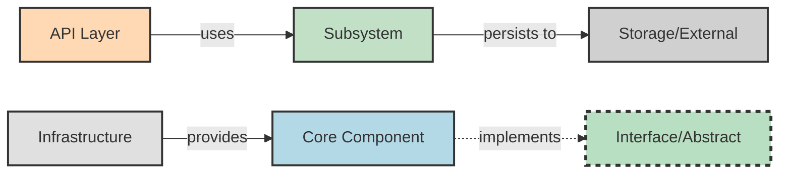

**Color Coding:**
- **Blue**: Core application components
- **Orange**: API layer components
- **Green**: Internal subsystems and business logic
- **Gray**: Storage and external services
- **Light Gray**: Infrastructure and frameworks
- **Dashed Border**: Interfaces or abstract components

**Relationship Types:**
- **Solid Arrow** (→): Direct dependency or usage
- **Dashed Arrow** (⇢): Interface implementation or loose coupling
- **Dotted Arrow** (⋯→): Event-based communication
- **Bold Arrow**: Critical/primary relationship

---

## Main Architecture Overview

This diagram shows all major subsystems and their primary relationships.

```mermaid
graph TB
    %% Style Definitions
    classDef coreStyle fill:#B3D9E6,stroke:#333,stroke-width:2px
    classDef apiStyle fill:#FFD9B3,stroke:#333,stroke-width:2px
    classDef subsystemStyle fill:#C2E0C6,stroke:#333,stroke-width:2px
    classDef storageStyle fill:#D0D0D0,stroke:#333,stroke-width:2px
    classDef externalStyle fill:#E0E0E0,stroke:#333,stroke-width:2px

    %% Core Application
    subgraph Core["Core Application Layer"]
        Cryostat[Cryostat Main App]:::coreStyle
        Config[Configuration]:::coreStyle
        Health[Health Checks]:::coreStyle
    end

    %% API Layers
    subgraph APIs["API Layers"]
        REST[REST API]:::apiStyle
        GraphQL[GraphQL API]:::apiStyle
        WebSocket[WebSocket]:::apiStyle
    end

    %% Subsystems
    subgraph Subsystems["Core Subsystems"]
        Discovery[Discovery]:::subsystemStyle
        Targets[Target Management]:::subsystemStyle
        Recordings[Recording Management]:::subsystemStyle
        Templates[Event Templates]:::subsystemStyle
        Rules[Rules Engine]:::subsystemStyle
        Reports[Reports & Analysis]:::subsystemStyle
        Diagnostics[Diagnostics]:::subsystemStyle
        JMCAgent[JMC Agent Integration]:::subsystemStyle
        Security[Security & Credentials]:::subsystemStyle
    end

    %% Storage
    subgraph Storage["Storage Layer"]
        Database[(PostgreSQL)]:::storageStyle
        S3[(S3 Storage)]:::storageStyle
    end

    %% External
    subgraph External["External Services"]
        ReportSidecar[Report Sidecar]:::externalStyle
        CryostatAgent[Cryostat Agent]:::externalStyle
        K8sAPI[Kubernetes API]:::externalStyle
    end

    %% Infrastructure
    subgraph Infrastructure["Infrastructure"]
        Quarkus[Quarkus Framework]:::externalStyle
        CryostatCore[cryostat-core]:::externalStyle
        JMC[JDK Mission Control]:::externalStyle
    end

    %% Relationships
    Cryostat --> Config
    Cryostat --> Health
    Cryostat --> Quarkus
    Cryostat --> CryostatCore

    REST --> Targets
    REST --> Recordings
    REST --> Rules
    REST --> Reports
    GraphQL --> Discovery
    GraphQL --> Targets

    Discovery --> Targets
    Discovery --> K8sAPI
    Targets --> Security
    Targets --> CryostatAgent
    Recordings --> Targets
    Recordings --> Templates
    Recordings --> S3
    Rules --> Recordings
    Reports --> Recordings
    Reports --> ReportSidecar
    Diagnostics --> Targets
    JMCAgent --> Targets

    Targets --> Database
    Rules --> Database
    Security --> Database
    Recordings --> Database

    CryostatCore --> JMC
    Targets --> CryostatCore
    Recordings --> CryostatCore

    Targets -.->|events| WebSocket
    Recordings -.->|events| WebSocket
    Rules -.->|events| WebSocket
```

---

## Detailed Subsystem Diagrams

### 1. Core Application Layer

The foundation of the Cryostat application, including the main entry point, configuration management, and health monitoring.

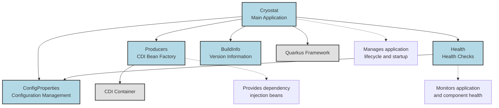

**Key Components:**

- **Cryostat**: Main application class, entry point
- **ConfigProperties**: Centralized configuration management
- **Producers**: CDI bean factory for dependency injection
- **Health**: Health check endpoints and monitoring
- **BuildInfo**: Version and build information

**Responsibilities:**
- Application lifecycle management
- Configuration loading and validation
- Dependency injection setup
- Health monitoring and reporting

---

### 2. API Layers

The API layers provide multiple interfaces for interacting with Cryostat: REST, GraphQL, and WebSocket.

#### 2.1 REST API

```mermaid
graph TB
    %% Style Definitions
    classDef apiStyle fill:#FFD9B3,stroke:#333,stroke-width:2px
    classDef subsystemStyle fill:#C2E0C6,stroke:#333,stroke-width:2px

    %% REST Endpoints
    subgraph REST["REST API Endpoints"]
        Targets_REST[Targets]:::apiStyle
        ActiveRecordings_REST[ActiveRecordings]:::apiStyle
        ArchivedRecordings_REST[ArchivedRecordings]:::apiStyle
        Snapshots_REST[Snapshots]:::apiStyle
        EventTemplates_REST[EventTemplates]:::apiStyle
        Rules_REST[Rules]:::apiStyle
        Reports_REST[Reports]:::apiStyle
        Diagnostics_REST[Diagnostics]:::apiStyle
        Discovery_REST[Discovery]:::apiStyle
        Credentials_REST[Credentials]:::apiStyle
        Auth_REST[Auth]:::apiStyle
        TrustStore_REST[TrustStore]:::apiStyle
        JMCAgentProbes_REST[JMCAgentProbes]:::apiStyle
        JMCAgentTemplates_REST[JMCAgentTemplates]:::apiStyle
        MatchExpressions_REST[MatchExpressions]:::apiStyle
    end

    %% Core Services
    TargetService[Target Service]:::subsystemStyle
    RecordingService[Recording Service]:::subsystemStyle
    RuleService[Rule Service]:::subsystemStyle
    ReportService[Report Service]:::subsystemStyle
    DiagnosticService[Diagnostic Service]:::subsystemStyle
    SecurityService[Security Service]:::subsystemStyle

    %% Relationships
    Targets_REST --> TargetService
    ActiveRecordings_REST --> RecordingService
    ArchivedRecordings_REST --> RecordingService
    Snapshots_REST --> RecordingService
    EventTemplates_REST --> RecordingService
    Rules_REST --> RuleService
    Reports_REST --> ReportService
    Diagnostics_REST --> DiagnosticService
    Discovery_REST --> TargetService
    Credentials_REST --> SecurityService
    Auth_REST --> SecurityService
    TrustStore_REST --> SecurityService
    JMCAgentProbes_REST --> TargetService
    JMCAgentTemplates_REST --> RecordingService
    MatchExpressions_REST --> RuleService
```

#### 2.2 GraphQL API

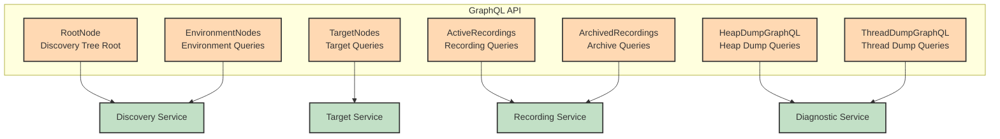

#### 2.3 WebSocket API

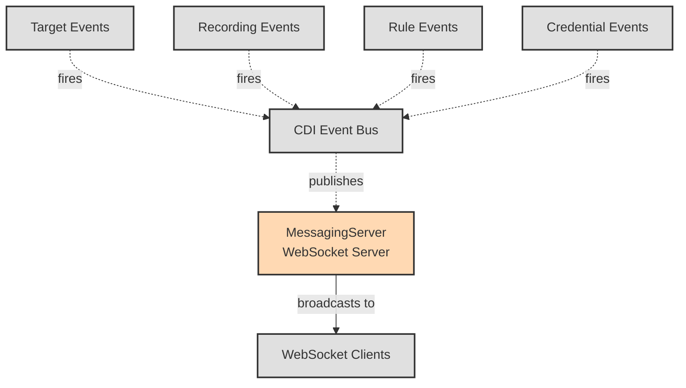

**API Layer Features:**

- **REST API**: Comprehensive CRUD operations for all resources
- **GraphQL API**: Flexible querying with discovery tree navigation
- **WebSocket**: Real-time event notifications for UI updates

---

### 3. Discovery Subsystem

The Discovery Subsystem automatically discovers JVM targets across different environments.

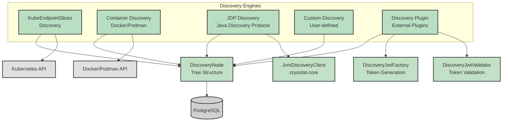

**Discovery Engines:**

1. **KubeEndpointSlices Discovery**: Discovers JVMs in Kubernetes via EndpointSlices API
2. **Container Discovery**: Discovers JVMs in Docker/Podman containers
3. **JDP Discovery**: Uses Java Discovery Protocol for local network discovery
4. **Custom Discovery**: User-defined discovery mechanisms
5. **Discovery Plugin**: External plugin-based discovery extensions

**Key Features:**
- Hierarchical tree structure for organizing discovered targets
- JWT-based authentication for plugin discovery
- Persistent storage of discovery tree in PostgreSQL
- Real-time updates via event bus

---

### 4. Target Management

Target Management handles connections to discovered JVM targets using both JMX and Agent protocols.

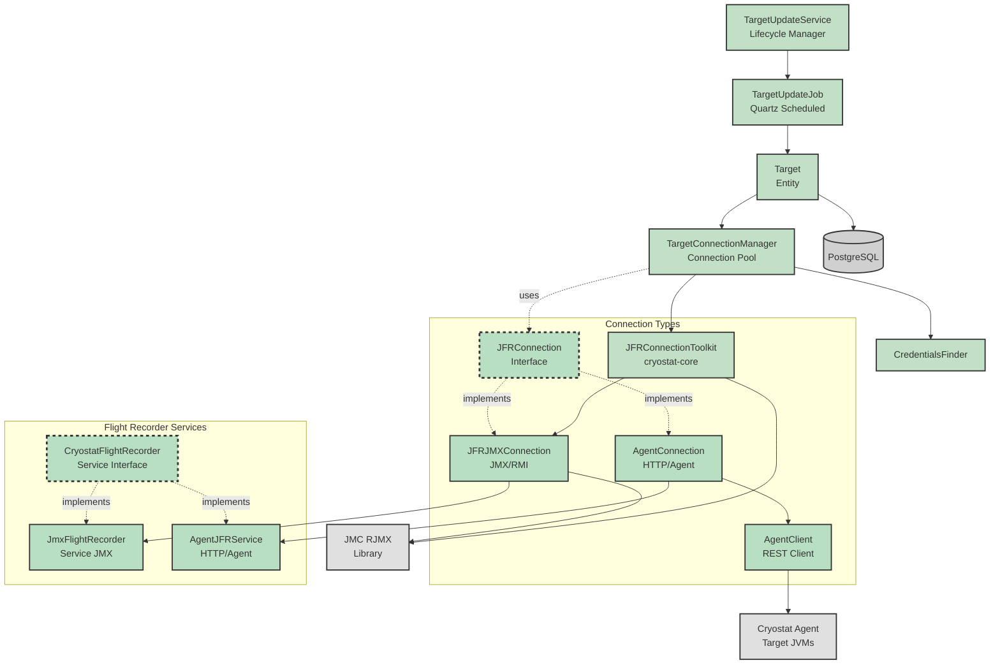

**Connection Types:**

1. **JMX/RMI Connection**: Traditional JMX connection using RMI protocol
   - Uses cryostat-core's JFRConnectionToolkit
   - Leverages JMC RJMX library
   - Provides JmxFlightRecorderService

2. **Agent Connection**: HTTP-based connection to Cryostat Agent
   - Uses AgentClient REST client
   - Communicates with Cryostat Agent in target JVM
   - Provides AgentJFRService

**Key Features:**
- Connection pooling for efficient resource management
- Credential matching for secure connections
- Scheduled target updates via Quartz
- Support for both JMX and Agent protocols
- Persistent target storage in PostgreSQL

---

### 5. Recording Management

Recording Management handles the complete lifecycle of JFR recordings: creation, monitoring, archiving, and deletion.

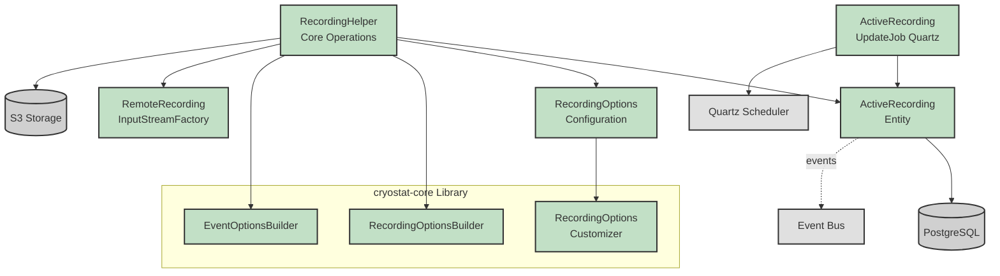

**Key Components:**

- **ActiveRecording**: Entity representing an active JFR recording
- **RecordingHelper**: Core service for recording operations
- **RecordingOptions**: Configuration for recording parameters
- **RecordingOptionsBuilder**: Builder from cryostat-core for creating recording options
- **EventOptionsBuilder**: Builder for event-specific options
- **RemoteRecordingInputStreamFactory**: Streams recording data from targets
- **ActiveRecordingUpdateJob**: Scheduled job to update recording metadata

**Recording Lifecycle:**

1. **Creation**: User or rule creates recording with specified options
2. **Monitoring**: Scheduled job updates recording state and metadata
3. **Archiving**: Recording data archived to S3 storage
4. **Deletion**: Recording removed from target and metadata cleaned up

**Features:**
- Customizable recording options (duration, max size, max age)
- Event-specific configuration
- Automatic archiving to S3
- Real-time status updates via event bus
- Persistent metadata in PostgreSQL

---

### 6. Event Templates

Event Templates define which JFR events to record and their configuration.

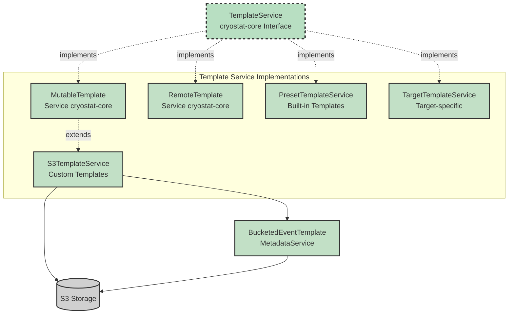

**Template Types:**

1. **S3 Templates**: Custom user-uploaded templates stored in S3
   - Mutable (can be created, updated, deleted)
   - Backed by S3-compatible storage
   - Metadata service for efficient querying

2. **Preset Templates**: Built-in JFR templates
   - Immutable
   - Provided by JDK/JMC
   - Examples: Continuous, Profiling

3. **Target Templates**: Templates specific to a target JVM
   - Retrieved from target's JFR configuration
   - Read-only from Cryostat perspective

4. **Remote Templates**: Templates from remote sources
   - Can be fetched from URLs
   - Cached locally

**Features:**
- Template validation and parsing
- Metadata caching for performance
- Support for JFC (JFR Configuration) format
- Template inheritance and composition

---

### 7. Rules Engine

The Rules Engine automates recording creation based on match expressions and schedules.

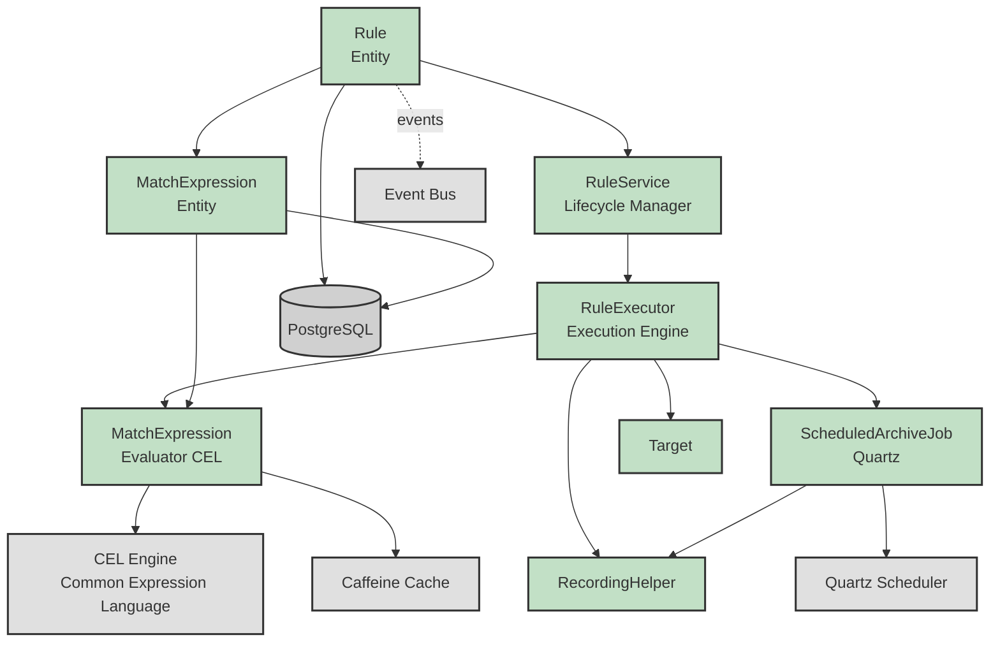

**Key Components:**

- **Rule**: Entity defining automated recording rules
- **MatchExpression**: CEL expression for target matching
- **RuleService**: Manages rule lifecycle
- **RuleExecutor**: Executes rules against matching targets
- **MatchExpressionEvaluator**: Evaluates CEL expressions
- **ScheduledArchiveJob**: Scheduled job for archiving rule-created recordings

**Rule Execution Flow:**

1. **Target Discovery**: New target discovered or updated
2. **Expression Evaluation**: Match expressions evaluated against target
3. **Recording Creation**: If match, recording created via RecordingHelper
4. **Scheduled Archiving**: Recording archived based on rule configuration
5. **Event Notification**: Events published for UI updates

**Features:**
- CEL (Common Expression Language) for flexible matching
- Expression result caching for performance
- Automatic recording lifecycle management
- Scheduled archiving with configurable intervals
- Support for complex target matching criteria

---

### 8. Reports & Analysis

Reports & Analysis generates and caches analysis reports from JFR recordings.

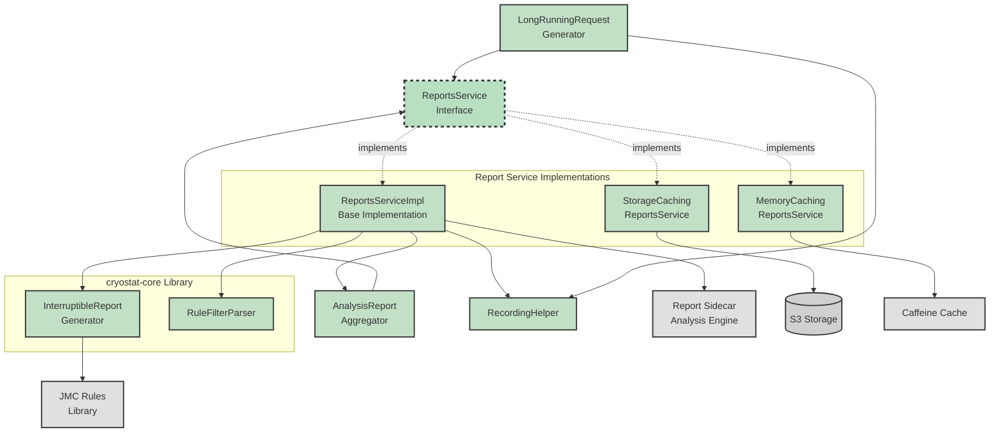

**Report Generation Flow:**

1. **Request**: User requests report for a recording
2. **Cache Check**: Check memory and storage caches
3. **Generation**: If not cached, generate via Report Sidecar
4. **Aggregation**: Aggregate multiple report results if needed
5. **Caching**: Cache result in memory and/or storage
6. **Response**: Return report to user

**Key Features:**

- **Multi-level Caching**: Memory (Caffeine) and storage (S3) caching
- **Report Sidecar**: External service for CPU-intensive analysis
- **Interruptible Generation**: Can cancel long-running report generation
- **Report Aggregation**: Combine multiple reports into aggregated view
- **Rule Filtering**: Filter report data based on JMC rules
- **Long-running Requests**: Support for async report generation

**Report Types:**
- Automated Analysis Report (JMC rules-based)
- Custom filtered reports
- Aggregated reports across multiple recordings

---

### 9. Diagnostics

Diagnostics provides heap dump and thread dump generation and storage.

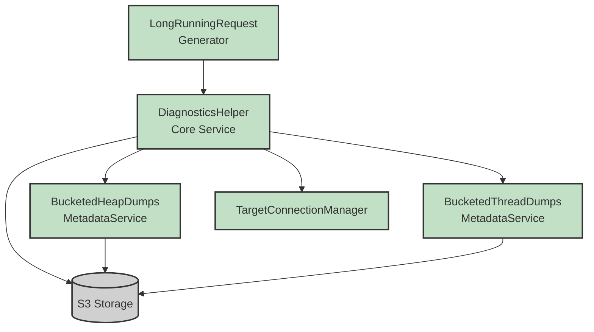

**Diagnostic Operations:**

1. **Heap Dump Generation**:
   - Trigger heap dump on target JVM
   - Stream dump data to S3 storage
   - Store metadata for retrieval
   - Support for large dumps via streaming

2. **Thread Dump Generation**:
   - Capture thread dump from target JVM
   - Store in S3 with metadata
   - Support for multiple formats

**Key Features:**
- Bucketed metadata for efficient querying
- Streaming support for large heap dumps
- Long-running request support for async operations
- Automatic cleanup of old diagnostics
- Per-target organization in S3

---

### 10. JMC Agent Integration

JMC Agent Integration provides dynamic probe management for JMC Agent instrumentation.

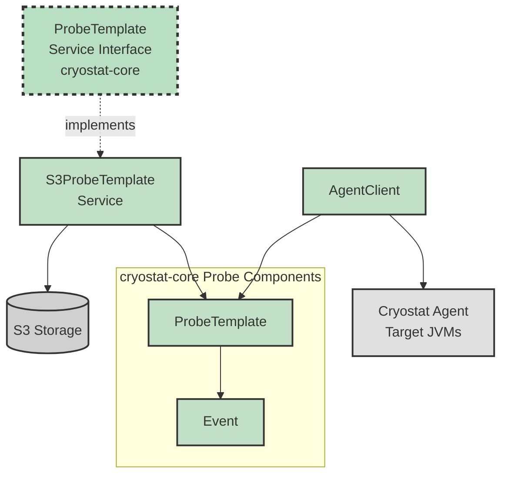

**JMC Agent Probes:**

JMC Agent allows dynamic instrumentation of Java applications without code changes or restarts.

**Key Components:**

- **ProbeTemplate**: XML template defining probe configuration
- **Event**: JFR event definition for probe data
- **S3ProbeTemplateService**: Manages probe templates in S3 storage
- **AgentClient**: Communicates with Cryostat Agent to deploy probes

**Probe Workflow:**

1. **Template Creation**: User creates probe template (XML)
2. **Template Storage**: Template stored in S3
3. **Probe Deployment**: Template sent to target via AgentClient
4. **Agent Processing**: Cryostat Agent instruments target JVM
5. **Event Generation**: Probe generates JFR events
6. **Event Recording**: Events captured in JFR recordings

**Features:**
- Dynamic probe creation and deployment
- No target restart required
- JFR event generation from probes
- Template versioning and management
- Support for method entry/exit, field access, etc.

---

### 11. Security & Credentials

Security & Credentials manages authentication, authorization, and credential storage for target connections.

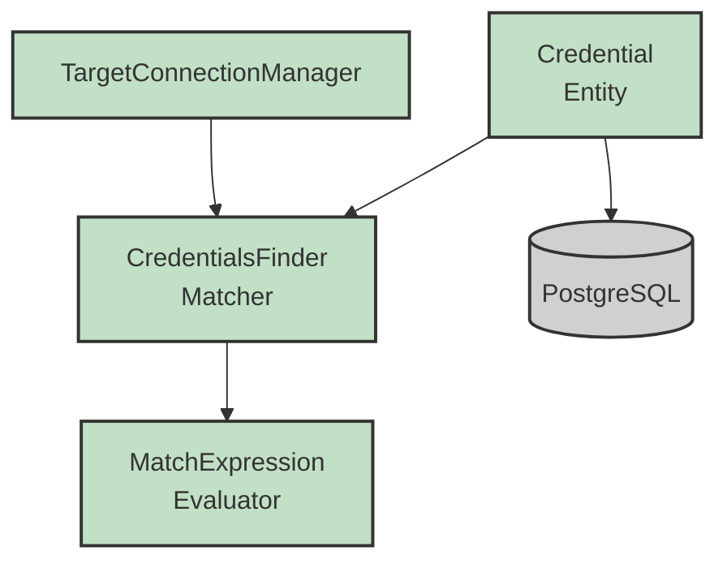

**Credential Management:**

**Key Components:**

- **Credential**: Entity storing connection credentials (username, password, etc.)
- **CredentialsFinder**: Matches credentials to targets using match expressions

**Credential Matching:**

1. **Target Connection Request**: Connection requested for a target
2. **Expression Evaluation**: Match expressions evaluated against target
3. **Credential Selection**: Best matching credential selected
4. **Connection Establishment**: Credential used for connection

**Features:**
- Secure credential storage in PostgreSQL
- CEL-based credential matching
- Support for multiple credentials per target
- Automatic credential selection
- Credential validation and testing

**Security Features:**
- Encrypted credential storage
- Role-based access control (via Quarkus Security)
- TrustStore management for SSL/TLS
- Authentication via various mechanisms (Basic, Token, etc.)

---

### 12. Storage Layer

The Storage Layer provides persistent storage for entities and object storage for recordings and diagnostics.

```mermaid
graph TB
    %% Style Definitions
    classDef storageStyle fill:#D0D0D0,stroke:#333,stroke-width:2px
    classDef metadataStyle fill:#D5D5D5,stroke:#333,stroke-width:2px
    classDef subsystemStyle fill:#C2E0C6,stroke:#333,stroke-width:2px

    %% Storage Systems
    Database[(PostgreSQL<br/>Database)]:::storageStyle
    S3[(S3-Compatible<br/>Storage)]:::storageStyle

    %% Storage Management
    StorageBuckets[StorageBuckets<br/>Bucket Manager]:::subsystemStyle

    %% Metadata Services
    subgraph MetadataServices["Metadata Services"]
        ArchivedRecordingMetadata[ArchivedRecording<br/>MetadataService]:::metadataStyle
        HeapDumpsMetadata[HeapDumps<br/>MetadataService]:::metadataStyle
        ThreadDumpsMetadata[ThreadDumps<br/>MetadataService]:::metadataStyle
    end

    %% Entities Stored in Database
    subgraph DatabaseEntities["Database Entities"]
        Target[Target]:::subsystemStyle
        ActiveRecording[ActiveRecording]:::subsystemStyle
        Rule[Rule]:::subsystemStyle
        Credential[Credential]:::subsystemStyle
        MatchExpression[MatchExpression]:::subsystemStyle
        DiscoveryNode[DiscoveryNode]:::subsystemStyle
    end

    %% Objects Stored in S3
    subgraph S3Objects["S3 Objects"]
        ArchivedRecordings[Archived Recordings]:::subsystemStyle
        EventTemplates[Event Templates]:::subsystemStyle
        ProbeTemplates[Probe Templates]:::subsystemStyle
        HeapDumps[Heap Dumps]:::subsystemStyle
        ThreadDumps[Thread Dumps]:::subsystemStyle
        Reports[Cached Reports]:::subsystemStyle
    end

    %% Relationships
    StorageBuckets --> S3
    ArchivedRecordingMetadata --> S3
    HeapDumpsMetadata --> S3
    ThreadDumpsMetadata --> S3

    Target --> Database
    ActiveRecording --> Database
    Rule --> Database
    Credential --> Database
    MatchExpression --> Database
    DiscoveryNode --> Database

    ArchivedRecordings --> S3
    EventTemplates --> S3
    ProbeTemplates --> S3
    HeapDumps --> S3
    ThreadDumps --> S3
    Reports --> S3
```

**Storage Architecture:**

### PostgreSQL Database
Stores structured entity data:
- **Targets**: JVM target information
- **ActiveRecordings**: Active recording metadata
- **Rules**: Automated recording rules
- **Credentials**: Connection credentials
- **MatchExpressions**: CEL expressions for matching
- **DiscoveryNodes**: Discovery tree structure

### S3-Compatible Storage
Stores large binary objects:
- **Archived Recordings**: JFR recording files (.jfr)
- **Event Templates**: JFC template files (.jfc)
- **Probe Templates**: JMC Agent probe definitions (.xml)
- **Heap Dumps**: Heap dump files (.hprof)
- **Thread Dumps**: Thread dump files (.txt)
- **Cached Reports**: Generated analysis reports (.html, .json)

**Key Features:**

- **Bucket Management**: Automatic bucket creation and organization
- **Metadata Services**: Efficient querying without reading full objects
- **Bucketed Metadata**: Hierarchical organization for scalability
- **Object Lifecycle**: Automatic cleanup of old objects
- **Streaming Support**: Efficient handling of large files

**Storage Patterns:**

1. **Bucketed Organization**: Objects organized by target, date, type
2. **Metadata Caching**: Metadata stored separately for fast queries
3. **Lazy Loading**: Objects loaded only when needed
4. **Streaming**: Large objects streamed rather than loaded into memory

---

### 13. External Services

External Services are components that Cryostat integrates with but are deployed separately.

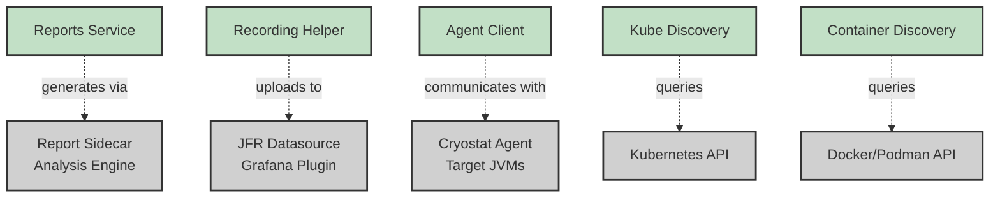

**External Service Details:**

### 1. Report Sidecar
- **Purpose**: CPU-intensive JFR analysis and report generation
- **Technology**: Separate container/process
- **Communication**: HTTP REST API
- **Features**:
  - Automated analysis using JMC rules
  - HTML and JSON report generation
  - Scalable analysis processing
  - Isolated from main application

### 2. JFR Datasource
- **Purpose**: Grafana plugin for visualizing JFR data
- **Technology**: Grafana datasource plugin
- **Communication**: HTTP REST API
- **Features**:
  - Real-time JFR data visualization
  - Custom dashboards
  - Time-series queries
  - Integration with Grafana ecosystem

### 3. Cryostat Agent
- **Purpose**: Lightweight agent in target JVMs
- **Technology**: Java agent (JAR)
- **Communication**: HTTP REST API
- **Features**:
  - HTTP-based JFR control (alternative to JMX)
  - JMC Agent probe deployment
  - Lower overhead than JMX
  - Works in restricted environments

### 4. Kubernetes API
- **Purpose**: Discover JVM targets in Kubernetes
- **Technology**: Kubernetes REST API
- **Communication**: HTTP REST API
- **Features**:
  - EndpointSlices discovery
  - Pod and service discovery
  - Label-based filtering
  - Real-time updates via watches

### 5. Docker/Podman API
- **Purpose**: Discover JVM targets in containers
- **Technology**: Docker/Podman REST API
- **Communication**: HTTP REST API or Unix socket
- **Features**:
  - Container discovery
  - Label-based filtering
  - Network inspection
  - Container lifecycle events

---

### 14. Infrastructure

Infrastructure components provide the foundational frameworks and libraries.

```mermaid
graph TB
    %% Style Definitions
    classDef infraStyle fill:#E0E0E0,stroke:#333,stroke-width:2px
    classDef coreStyle fill:#D5D5D5,stroke:#333,stroke-width:2px
    classDef jmcStyle fill:#D5D5D5,stroke:#333,stroke-width:2px

    %% Quarkus Framework
    Quarkus[Quarkus Framework]:::infraStyle
    subgraph QuarkusFeatures["Quarkus Features"]
        QuarkusREST[REST JAX-RS]:::infraStyle
        QuarkusGraphQL[GraphQL SmallRye]:::infraStyle
        QuarkusCDI[CDI Arc]:::infraStyle
        QuarkusHibernate[Hibernate ORM]:::infraStyle
        QuarkusWebSocket[WebSocket]:::infraStyle
        QuarkusSecurity[Security]:::infraStyle
    end

    %% Scheduling and Caching
    QuartzScheduler[Quartz Scheduler<br/>Job Scheduling]:::infraStyle
    CaffeineCache[Caffeine Cache<br/>In-Memory Caching]:::infraStyle
    EventBus[Event Bus<br/>CDI Events]:::infraStyle

    %% cryostat-core Library
    subgraph CryostatCore["cryostat-core Library"]
        JFRConnectionToolkit[JFR Connection Toolkit]:::coreStyle
        FlightRecorderServices[Flight Recorder Services]:::coreStyle
        TemplateServices[Template Services]:::coreStyle
        ReportGenerator[Report Generator]:::coreStyle
        RecordingOptionsBuilders[Recording Options Builders]:::coreStyle
    end

    %% JDK Mission Control
    subgraph JMC["JDK Mission Control JMC"]
        JMC_Common[JMC Common]:::jmcStyle
        JMC_FlightRecorder[JMC FlightRecorder]:::jmcStyle
        JMC_RJMX[JMC RJMX]:::jmcStyle
        JMC_Rules[JMC Rules]:::jmcStyle
    end

    %% Relationships
    Quarkus --> QuarkusREST
    Quarkus --> QuarkusGraphQL
    Quarkus --> QuarkusCDI
    Quarkus --> QuarkusHibernate
    Quarkus --> QuarkusWebSocket
    Quarkus --> QuarkusSecurity

    JFRConnectionToolkit --> JMC_RJMX
    FlightRecorderServices --> JMC_FlightRecorder
    ReportGenerator --> JMC_Rules
    RecordingOptionsBuilders --> JMC_FlightRecorder

    JMC_FlightRecorder --> JMC_Common
    JMC_RJMX --> JMC_Common
    JMC_Rules --> JMC_Common
```

**Infrastructure Components:**

### Quarkus Framework
Modern Java framework providing:
- **REST**: JAX-RS for REST API endpoints
- **GraphQL**: SmallRye GraphQL for query API
- **CDI**: Dependency injection with Arc
- **Hibernate ORM**: Database persistence
- **WebSocket**: Real-time communication
- **Security**: Authentication and authorization
- **Native Compilation**: GraalVM native image support

### Quartz Scheduler
Enterprise job scheduling:
- **Scheduled Jobs**: Cron-based scheduling
- **Job Persistence**: Database-backed job storage
- **Clustering**: Distributed job execution
- **Triggers**: Flexible trigger mechanisms

### Caffeine Cache
High-performance in-memory caching:
- **LRU Eviction**: Least recently used eviction
- **Size-based**: Maximum size limits
- **Time-based**: TTL and expiration
- **Statistics**: Cache hit/miss metrics

### Event Bus
CDI event-based communication:
- **Loose Coupling**: Decoupled components
- **Async Events**: Asynchronous processing
- **Event Filtering**: Qualifier-based filtering
- **Type Safety**: Compile-time type checking

### cryostat-core Library
Core JFR management capabilities:
- **JFR Connection Toolkit**: JMX connection management
- **Flight Recorder Services**: JFR operation abstractions
- **Template Services**: Template parsing and management
- **Report Generator**: JMC rules-based analysis
- **Recording Options Builders**: Fluent API for recording configuration

### JDK Mission Control (JMC)
JMC libraries for JFR operations:
- **JMC Common**: Common utilities and data structures
- **JMC FlightRecorder**: JFR parsing and manipulation
- **JMC RJMX**: Remote JMX connection handling
- **JMC Rules**: Automated analysis rules engine

---

### 15. Cross-Cutting Concerns

Cross-cutting concerns are aspects that affect multiple parts of the application.

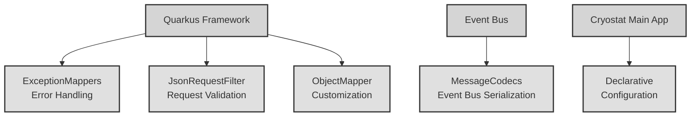

**Cross-Cutting Components:**

### 1. ExceptionMappers
- **Purpose**: Centralized exception handling
- **Features**:
  - Maps exceptions to HTTP responses
  - Consistent error format
  - Logging and monitoring
  - User-friendly error messages

### 2. JsonRequestFilter
- **Purpose**: Request validation and filtering
- **Features**:
  - Content-type validation
  - Request body validation
  - Security checks
  - Request logging

### 3. ObjectMapperCustomization
- **Purpose**: JSON serialization configuration
- **Features**:
  - Custom serializers/deserializers
  - Date format configuration
  - Null handling
  - Pretty printing

### 4. MessageCodecs
- **Purpose**: Event bus message serialization
- **Features**:
  - Custom codec registration
  - Type-safe serialization
  - Performance optimization
  - Versioning support

### 5. DeclarativeConfiguration
- **Purpose**: YAML-based configuration
- **Features**:
  - Declarative target definitions
  - Rule definitions
  - Credential definitions
  - Configuration validation

---

## Maintenance Instructions

### Updating This Documentation

To request updates to this architecture documentation after code changes, use this prompt:

```
Please analyze the recent changes in the Cryostat codebase (excluding
src/main/webui) and the cryostat-core library (https://github.com/cryostatio/cryostat-core),
then update the cryostat-architecture-mermaid.md file to reflect:

1. Any new components, classes, or services that have been added
2. Any removed or deprecated components
3. Changes to relationships and dependencies between components
4. New subsystems or architectural layers
5. Changes to external integrations or storage mechanisms
6. Updates to the API layers (REST, GraphQL, WebSocket)
7. Changes to cryostat-core interfaces and implementations (JFRConnection,
   CryostatFlightRecorderService, TemplateService, etc.)
8. Updates to JMX connection handling or Agent connection protocols

When analyzing, please:
- Check Cryostat sources for usage of cryostat-core classes (search for
  'import io.cryostat.core.*' and 'import io.cryostat.libcryostat.*')
- Review cryostat-core repository for interface changes and new implementations
- Identify which components are from cryostat-core vs Cryostat application
- Maintain the existing visual style and organization
- Update the 'Created' date in the header
- Provide a summary of the changes made

Note: cryostat-core provides foundational JFR management capabilities including
connection handling (JMX and Agent), flight recorder services, template services,
report generation, and recording options builders.
```

### Generating Visualizations

These Mermaid diagrams can be rendered in:
- **GitHub/GitLab**: Automatic rendering in markdown files
- **VS Code**: Mermaid preview extensions
- **Mermaid Live Editor**: https://mermaid.live/
- **Documentation Sites**: MkDocs, Docusaurus, etc.

### Related Files

- **Original Graphviz**: `cryostat-architecture.dot`
- **Simplified Overview**: `cryostat-architecture-mermaid-simple.md`
- **SVG Visualization**: `cryostat-architecture.svg`

---

## Summary

This comprehensive architecture documentation provides:

1. **High-level Overview**: Understanding the major subsystems
2. **Detailed Diagrams**: Component-level architecture for each subsystem
3. **Relationship Mapping**: How components interact and depend on each other
4. **Technology Stack**: Frameworks and libraries used
5. **Maintenance Guide**: How to keep documentation up-to-date

The modular structure allows you to:
- Navigate to specific subsystems of interest
- Understand component relationships in detail
- Maintain and update documentation incrementally
- Generate visualizations for presentations and documentation

For a quick reference, see the simplified single-page diagram in `cryostat-architecture-mermaid-simple.md`.

---

*Generated from cryostat-architecture.dot on 2026-01-13*